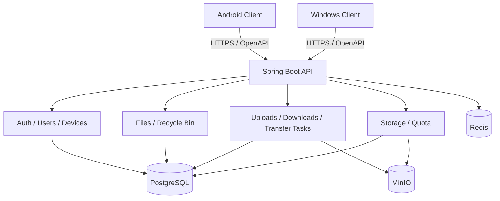

# LinkVault 1.0

LinkVault 1.0 是一个跨设备私有文件库项目，由 Flutter 客户端、Spring Boot 服务端和共享 OpenAPI 契约组成。项目当前聚焦 Android / Windows 客户端和可本地部署的后端服务，目标是提供一条完整的私有文件管理演示链路：注册登录、文件管理、上传下载、回收站、传输任务、设备管理和配额管理。

## 快速了解

| 部分 | 路径 | 说明 |
| --- | --- | --- |
| Flutter 客户端 | `linkvault-client/` | Android / Windows 用户界面、本地文件选择、上传下载和任务中心 |
| Spring Boot 服务端 | `linkvault-server/` | API、鉴权、文件元数据、上传下载任务、配额、设备和对象存储 |
| OpenAPI 契约 | `contracts/openapi/linkvault-api.yaml` | 前后端共享接口契约 |

核心技术栈：

- 客户端：Flutter、Dart、`http`、`file_selector`、`flutter_secure_storage`
- 服务端：Java 21、Spring Boot 3.5、Spring Security、Spring Data JPA、Flyway、Redis、MinIO
- 运行依赖：PostgreSQL 16、Redis 7、MinIO

## 当前功能

- 认证与账号：滑块验证码、注册、登录、刷新令牌、退出登录、修改资料、修改用户名、头像、密码、删除账号。
- 设备：上报当前设备、查看已登录设备、撤销设备会话。
- 文件：列表、搜索、创建文件夹、重命名、移动、复制、批量移动、批量复制、批量移入回收站。
- 上传：初始化上传、预签名上传 URL、直接上传、流式分块直传、上传进度、暂停、恢复、取消、文件夹上传任务。
- 下载：准备下载、断点恢复、后端流式下载、批量 ZIP 下载、下载进度、暂停、取消、完成。
- 任务中心：上传/下载任务列表、暂停/恢复单个任务、暂停/恢复全部任务、取消、删除、清理任务。
- 回收站：列表、恢复、彻底删除、清空。
- 配额与存储：用户配额查询和校验，文件节点与 MinIO 对象分离，存储对象引用计数。

暂不作为核心交付：自动多设备同步、P2P 快传、分享链接、正式 iOS/HarmonyOS/Web 客户端。

## 项目结构

```text
LinkVault/
  contracts/
    openapi/linkvault-api.yaml
  linkvault-client/
    lib/
      app/                    # 应用入口、主题、路由、依赖注入
      core/                   # 配置、网络、平台能力、传输恢复
      features/               # auth、files、profile、recycle_bin、transfers
      shared/                 # 复用组件
    config/server.json        # 默认 API 地址
    assets/                   # 图片和图标
    android/ windows/         # Flutter runner
    test/
  linkvault-server/
    src/main/java/com/linkvault/
      common/                 # 通用配置、响应、异常、安全、领域基础类
      modules/                # auth、users、devices、files、uploads 等模块
    src/main/resources/
      application*.yml
      db/migration/           # Flyway 迁移
    infra/docker/
      docker-compose.yml
      .env.example
    Dockerfile
```

## 架构



设计原则：

- 客户端和服务端独立构建、独立部署。
- 服务端采用模块化单体，避免早期引入微服务复杂度。
- 客户端不保存 MinIO 密钥，只通过后端获取短有效期访问能力。
- PostgreSQL 是用户、设备、文件树、对象引用和任务状态的事实来源。
- 文件节点和真实存储对象分离，避免多个文件引用同一对象时误删物理文件。
- OpenAPI 契约用于约束前后端接口，接口变更应同步更新。

## 服务端模块

| 模块 | 职责 |
| --- | --- |
| `health` | 健康检查 |
| `auth` | 验证码、注册、登录、刷新 Token、退出登录 |
| `users` | 当前用户资料、头像、用户名、密码、账号删除 |
| `devices` | 当前设备上报、设备列表、设备撤销 |
| `files` | 文件树、搜索、文件夹、重命名、移动、复制、回收 |
| `recyclebin` | 回收站列表、恢复、彻底删除、清空 |
| `storage` | MinIO 适配、存储对象、引用计数 |
| `uploads` | 上传初始化、直接上传、流式分块直传、文件夹上传 |
| `downloads` | 下载准备、流式下载、批量 ZIP 下载、进度上报 |
| `transfers` | 上传/下载任务中心 |
| `quota` | 用户容量查询、上传前校验、提交和释放容量 |

服务端统一使用 `/api/v1` 前缀，响应结构为 `ApiResponse<T>`，分页响应为 `PageResponse<T>`。安全上下文通过 JWT、`UserPrincipal` 和 `@CurrentUser` 传递。

## 客户端页面

客户端路由定义在 `linkvault-client/lib/app/router/app_router.dart`：

| 路由 | 页面 |
| --- | --- |
| `/` | 启动鉴权页 |
| `/login` | 登录 |
| `/register` | 注册 |
| `/files` | 文件库 |
| `/tasks` | 传输任务 |
| `/recycle-bin` | 回收站 |
| `/profile` | 个人中心 |
| `/settings/account` | 账号管理 |
| `/settings/devices` | 设备管理 |

## 数据模型

当前 Flyway 迁移包含以下核心表：

| 表 | 说明 |
| --- | --- |
| `users` | 用户账号、头像、角色和状态 |
| `refresh_tokens` | 刷新 Token，按用户和设备管理会话 |
| `captcha_challenges` | 验证码挑战 |
| `devices` | 登录设备、平台、应用版本、最后活跃时间 |
| `user_quotas` | 用户总容量和已用容量 |
| `file_nodes` | 用户可见的文件和文件夹树 |
| `storage_objects` | MinIO 真实对象、SHA-256、大小、引用计数 |
| `upload_tasks` | 上传任务、对象 key、状态和进度 |
| `folder_upload_tasks` | 文件夹上传任务 |
| `download_tasks` | 下载任务、进度和状态 |
| `transfer_tasks` | 传输任务中心记录，按用户和设备隔离 |

关键关系：

- 一个用户可以拥有多个设备、文件节点和传输任务。
- 文件节点是用户视角的逻辑文件；存储对象是 MinIO 中的真实对象记录。
- 上传和下载任务会同步到传输任务中心，方便客户端统一展示进度。

## 本地运行

### 准备环境

- JDK 21
- Maven 3.9 或 IDE 自带 Maven
- Flutter SDK
- Docker Desktop

### 启动服务端依赖

在 `linkvault-server` 目录启动 PostgreSQL、Redis、MinIO 和 Bucket 初始化任务：

```powershell
docker compose -f infra/docker/docker-compose.yml up -d postgres redis minio minio-init
```

默认地址：

- PostgreSQL: `localhost:5432`
- Redis: `localhost:6379`
- MinIO API: `http://localhost:9000`
- MinIO Console: `http://localhost:9001`
- MinIO 用户名/密码：`linkvault` / `linkvault-secret`
- MinIO Bucket: `linkvault`

### 启动服务端

```powershell
cd linkvault-server
mvn spring-boot:run
```

如果本机没有全局 Maven，请先安装 Maven，或在 IDE 中打开 `linkvault-server` 并运行 Spring Boot 应用。

健康检查：

```powershell
Invoke-RestMethod http://localhost:8080/api/v1/health
```

### 配置客户端 API 地址

客户端会按以下顺序读取 API 地址：

1. 当前工作目录的 `config/server.json`
2. 当前工作目录的 `server.json`
3. 可执行文件同级的 `config/server.json`
4. 可执行文件同级的 `server.json`
5. 打包进应用的 `linkvault-client/config/server.json`
6. 编译期默认值 `LINKVAULT_API_BASE_URL`，默认为 `http://localhost:8080/api/v1`

配置示例：

```json
{
  "baseUrl": "http://localhost:8080/api/v1"
}
```

或：

```json
{
  "scheme": "http",
  "host": "localhost",
  "port": 8080,
  "apiPath": "/api/v1"
}
```

仓库内置的 `linkvault-client/config/server.json` 当前指向局域网地址，跨机器运行时请按实际服务端地址修改。

### 启动客户端

Windows：

```powershell
cd linkvault-client
flutter pub get
flutter run -d windows
```

Android：

```powershell
cd linkvault-client
flutter pub get
flutter emulators --launch <emulator-id>
flutter run -d android
```

如果 Flutter 原生 runner 目录缺失，可以重新生成：

```powershell
cd linkvault-client
flutter create --platforms=android,windows --project-name linkvault_client --org com.linkvault .
```

## Docker 运行完整后端栈

在 `linkvault-server` 目录运行：

```powershell
docker compose -f infra/docker/docker-compose.yml up --build
```

该命令会启动 API、PostgreSQL、Redis、MinIO 和 Bucket 初始化任务。API 默认暴露在 `http://localhost:8080`。

## 构建与测试

服务端：

```powershell
cd linkvault-server
mvn test
mvn clean package
java -jar target/linkvault-server-1.0.0.jar
```

客户端：

```powershell
cd linkvault-client
flutter test
flutter build apk --release
flutter build windows --release
```

Windows 可执行文件生成在：

```text
linkvault-client/build/windows/x64/runner/Release/LinkVault.exe
```

## API 摘要

所有路径均以 `/api/v1` 为前缀。

| 分组 | 接口 |
| --- | --- |
| System | `GET /health` |
| Auth | `GET /auth/captcha`、`POST /auth/captcha/check`、`POST /auth/register`、`POST /auth/login`、`POST /auth/refresh`、`POST /auth/logout` |
| Users | `GET /users/me`、`PATCH /users/me`、`PATCH /users/me/username`、`PATCH /users/me/avatar`、`PATCH /users/me/password`、`DELETE /users/me`、`GET /users/me/quota` |
| Devices | `GET /devices`、`POST /devices/current`、`DELETE /devices/{deviceId}` |
| Files | `GET /files`、`GET /files/search`、`GET /files/{fileId}`、`POST /files/folders`、`PATCH /files/{fileId}/rename`、`PATCH /files/{fileId}/move`、`POST /files/{fileId}/copy`、`DELETE /files/{fileId}`、`PATCH /files/batch-move`、`POST /files/batch-copy`、`POST /files/batch-recycle` |
| Recycle Bin | `GET /recycle-bin`、`POST /recycle-bin/{fileId}/restore`、`DELETE /recycle-bin/{fileId}`、`DELETE /recycle-bin` |
| Uploads | `POST /uploads`、`POST /uploads/direct/init`、`POST /uploads/direct`、`POST /uploads/direct/chunk`、`GET /uploads/{uploadId}`、`GET /uploads/{uploadId}/resume`、`POST /uploads/{uploadId}/progress`、`POST /uploads/{uploadId}/complete`、`POST /uploads/{uploadId}/pause`、`POST /uploads/{uploadId}/resume`、`POST /uploads/{uploadId}/cancel` |
| Folder Uploads | `POST /folder-uploads`、`GET /folder-uploads/{folderUploadId}`、`POST /folder-uploads/{folderUploadId}/pause`、`POST /folder-uploads/{folderUploadId}/resume`、`POST /folder-uploads/{folderUploadId}/cancel` |
| Downloads | `POST /downloads`、`POST /downloads/{downloadTaskId}/resume`、`GET /downloads/files/{fileId}/stream`、`POST /downloads/batch/stream`、`POST /downloads/{downloadTaskId}/progress`、`POST /downloads/{downloadTaskId}/complete`、`POST /downloads/{downloadTaskId}/pause`、`POST /downloads/{downloadTaskId}/cancel` |
| Transfer Tasks | `GET /transfer-tasks`、`POST /transfer-tasks/{taskId}/progress`、`POST /transfer-tasks/{taskId}/pause`、`POST /transfer-tasks/{taskId}/resume`、`POST /transfer-tasks/{taskId}/cancel`、`DELETE /transfer-tasks/{taskId}`、`POST /transfer-tasks/pause-all`、`POST /transfer-tasks/resume-all`、`DELETE /transfer-tasks`、`DELETE /transfer-tasks/completed` |

## 常用地址

- API: `http://localhost:8080`
- API Base: `http://localhost:8080/api/v1`
- Health: `http://localhost:8080/api/v1/health`
- MinIO API: `http://localhost:9000`
- MinIO Console: `http://localhost:9001`
